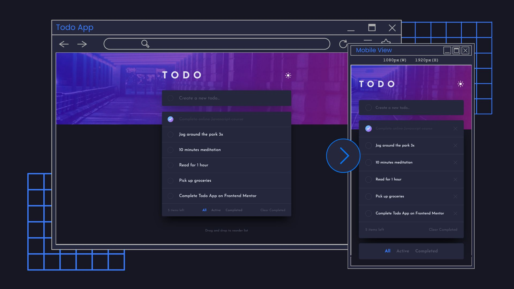
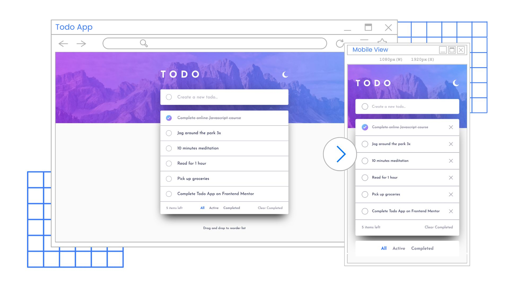

# Frontend Mentor - Todo app solution

[](https://app.netlify.com/sites/todo-app-erj/deploys)

This is a solution to the [Todo app challenge on Frontend Mentor](https://www.frontendmentor.io/challenges/todo-app-Su1_KokOW). Frontend Mentor challenges help you improve your coding skills by building realistic projects.

## Table of contents

- [Frontend Mentor - Todo app solution](#frontend-mentor---todo-app-solution)
	- [Table of contents](#table-of-contents)
	- [Overview](#overview)
		- [The challenge](#the-challenge)
		- [Screenshot](#screenshot)
		- [Links](#links)
	- [My process](#my-process)
		- [Built with](#built-with)
		- [What I learned](#what-i-learned)
		- [Continued development](#continued-development)
		- [Useful resources](#useful-resources)
	- [Author](#author)

## Overview

### The challenge

Users should be able to:

- View the optimal layout for the app depending on their device's screen size
- See hover states for all interactive elements on the page
- Add new todos to the list
- Mark todos as complete
- Delete todos from the list
- Filter by all/active/complete todos
- Clear all completed todos
- Toggle light and dark mode
- **Bonus**: Drag and drop to reorder items on the list

### Screenshot




### Links

- Solution URL: [https://github.com/erelropeta/fem-todo-app-main](https://github.com/erelropeta/fem-todo-app-main)
- Live Site URL: [https://todo-app-erj.netlify.app/](https://todo-app-erj.netlify.app/)

## My process

### Built with

- Semantic HTML5 markup
- CSS custom properties
- Flexbox
- Mobile-first workflow
- [BEM](https://getbem.com/) - CSS methodology
- [React](https://reactjs.org/) - JS library

### What I learned

- Getting preferred color scheme of the user

```js
window
  .matchMedia('(prefers-color-scheme: dark)')
  .addEventListener('change', (e) =>
    e.matches ? setDarkTheme(true) : setDarkTheme(false)
  );
```

- Responsive sizing using `clamp()` has a computation

Instead of computing for all sizing (`font-size`, `margin`, etc.), I utilized Marc Bacon's [Clamp() Function Calculator](https://www.marcbacon.com/tools/clamp-calculator/). I used `clamp()` from screen width `768px` because it wasn't giving the right size on mobile view (375px).

- Utilizing `useState` instead of using `useEffect`

```js
const getFilteredTodos = (todos, filter) => {
  if (filter === 'active') {
    return todos.filter((todo) => !todo.isComplete);
  } else if (filter === 'completed') {
    return todos.filter((todo) => todo.isComplete);
  } else {
    return todos;
  }
};

const visibleTodos = getFilteredTodos(todoList, filterBy);
```

### Continued development

### Useful resources

- [React Beautiful DnD](https://www.npmjs.com/package/react-beautiful-dnd) - For the smooth drag and drop feature.
- [Clamp() Function Calculator](https://www.marcbacon.com/tools/clamp-calculator/) - For calculating the responsive sizing of texts, widths, etc.
- [You Might Not Need an Effect](https://react.dev/learn/you-might-not-need-an-effect) - Wonderful tutorial in utilizing the power of state instead of unnecessarily using `useEffect`.

## Author

- LinkedIn - [Erel Ropeta](https://linkedin.com/in/erelropeta)
- Frontend Mentor - [@ereljapco](https://www.frontendmentor.io/profile/ereljapco)
